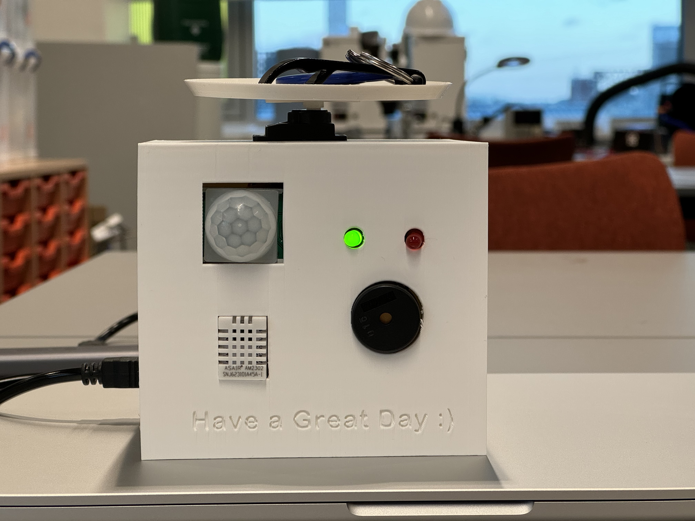
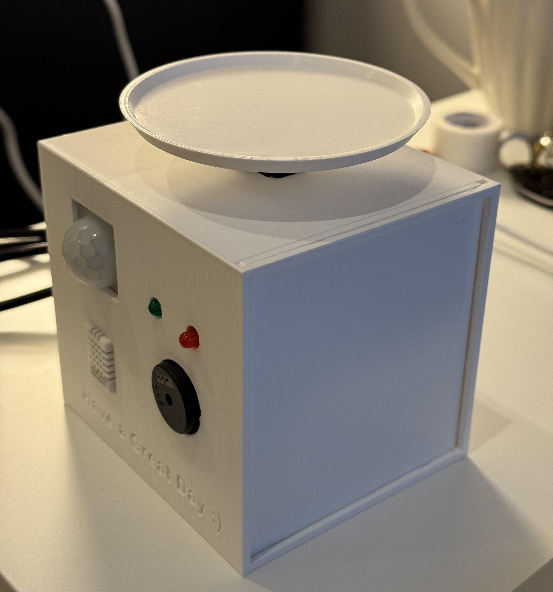
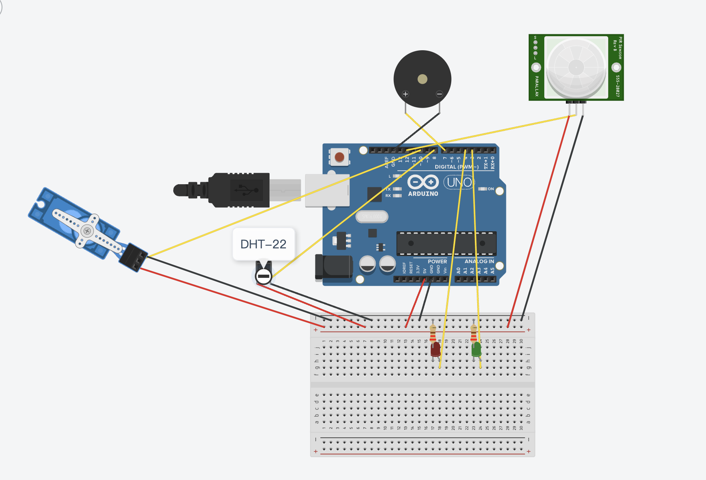
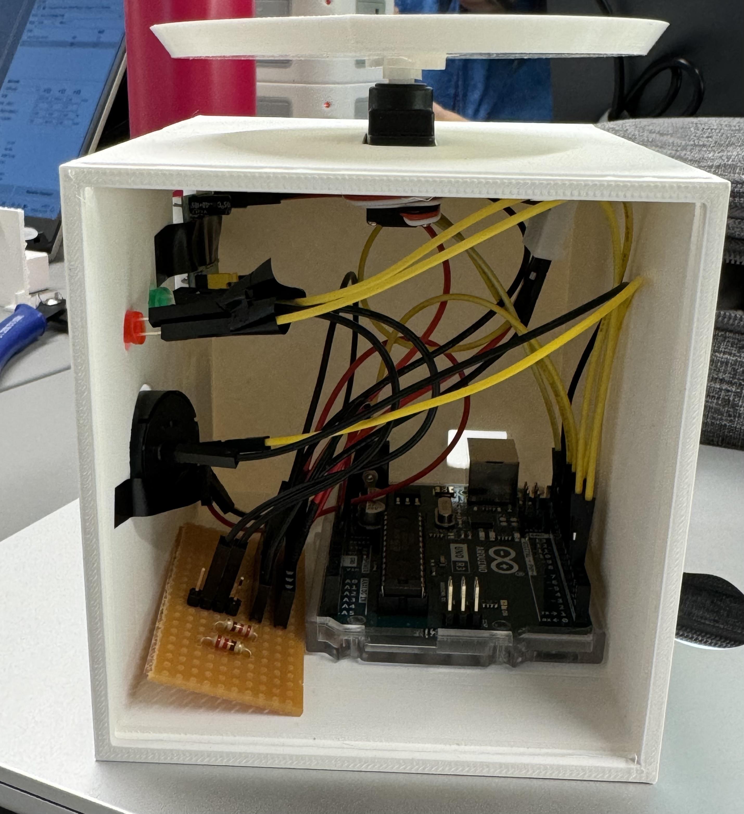
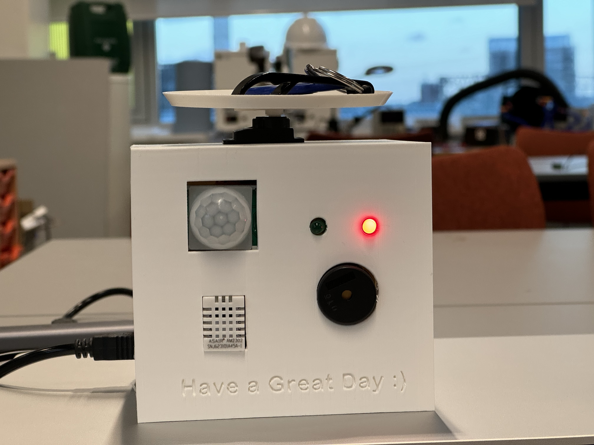
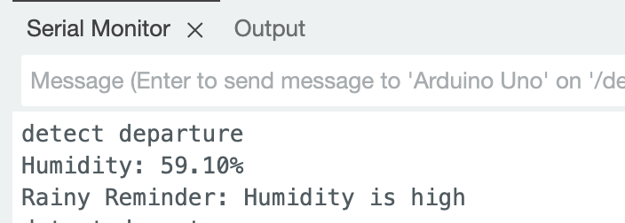

# CASA0016 -- Smart Doorway Reminder
   
# Overview
The Smart Doorway Reminder System is a sophisticated device designed to help individuals remember essential items like keys and umbrellas upon exiting their homes. Utilizing Arduino Uno, it employs a PIR sensor for motion detection and a DHT-22 sensor for humidity monitoring. When intent to exit is detected, it triggers visual and auditory reminders. Despite its efficacy, enhancements such as directional sensors could improve its accuracy.
# Background & Inspiration
The inspiration for the Smart Doorway Reminder System stems from a common issue faced by many:  
forgetting essential items such as keys or umbrellas when rushing out the door. This frequent oversight can disrupt daily routines and cause significant inconvenience, particularly in rainy days.
# Hardware components  
(1)Arduino uno  
(2)PIR motion sensor  
(3)DHT-22 temp/humidity sensor  
(4)Green & Red LEDs  
(5)220 Ω resistors  
(6)Servo motor  
(7)Buzzer
# Circuit Diagram
 

# How it works
### Feature 1 : Key Reminder  
  
Green LED stays ON default  
 PIR sensor detects motion for 5 seconds --> determines intent to exit  
 Red LED blinks twice  
 servo motor rotates tray to catch attention  

### Feature 2 : Rainy Day Reminder  
   
when detecting exit intent, the DHT-22 sensor checks humidity  
if humidity > present threshold (e.g., 55%), the buzzer sounds a short alerts

## Reference

